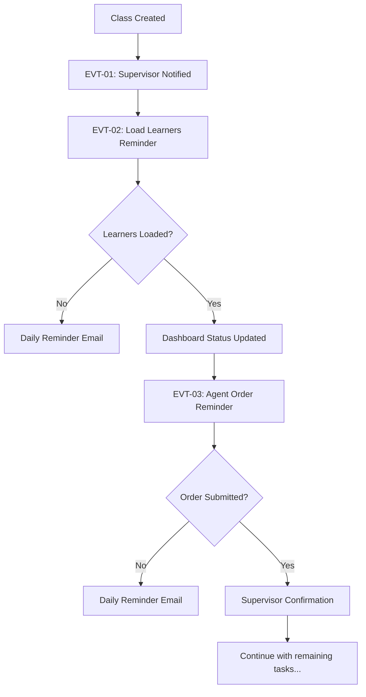

# WECOZA Notifications System - Product Requirements Document (PRD)

**Version:** 1.0
**Date:** September 18, 2025
**Author:** Technical Team
**Status:** Draft

---

## Table of Contents

1. [Executive Summary](#executive-summary)
2. [System Overview](#system-overview)
3. [Core Features](#core-features)
4. [Technical Architecture](#technical-architecture)
5. [User Workflows](#user-workflows)
6. [Database Design](#database-design)
7. [Implementation Phases](#implementation-phases)
8. [Event Specifications](#event-specifications)
9. [Dashboard Integration](#dashboard-integration)
10. [Success Metrics](#success-metrics)
11. [Risk Assessment](#risk-assessment)
12. [Appendices](#appendices)

---

## 1. Executive Summary

### 1.1 Project Overview

The WECOZA Notifications System is a comprehensive notification management solution designed to handle the complex workflow of training class management. The system implements a **two-phase notification model** (Reminders & Confirmations) that ensures all stakeholders are informed of task status and required actions throughout the class lifecycle.

### 1.2 Core Objectives

- **Automate Communication**: Eliminate manual status updates and reduce "Has this been done?" inquiries
- **Ensure Accountability**: Provide clear reminders to responsible users for pending tasks
- **Maintain Transparency**: Keep supervisors, learners, and agents informed of progress
- **Create Audit Trail**: Maintain complete record of all notifications and status changes
- **Enable Dashboard Monitoring**: Provide real-time status visibility through dashboard tiles

### 1.3 Key Benefits

- **Reduced Manual Effort**: 80% reduction in manual status communication
- **Improved Compliance**: Automated reminders prevent missed deadlines
- **Enhanced Visibility**: Real-time dashboard shows complete class status
- **Scalable Architecture**: Independent plugin can support multiple workflows
- **Audit Compliance**: Complete notification history for regulatory requirements

---

## 2. System Overview

### 2.1 Architecture Philosophy

The WECOZA Notifications System follows a **decoupled, event-driven architecture** with these core principles:

- **Single Responsibility**: Dedicated notifications plugin handles only notification logic
- **Event-Driven**: Producer plugins emit events; notification system consumes and processes
- **Resilient**: Hybrid detection system (hooks + polling) ensures no missed events
- **Scalable**: Can support multiple feature plugins (classes, exams, QA visits, etc.)
- **Configurable**: Admin-controlled templates, routing, and supervisor management

### 2.2 High-Level Components

```
┌─────────────────────┐    Events    ┌──────────────────────┐
│ wecoza-classes-     │──────────────→│ wecoza-notifications-│
│ plugin              │               │ core                 │
└─────────────────────┘               └──────────────────────┘
         │                                       │
         │                                       ├─→ Email System
         │                                       ├─→ Dashboard Updates
         ▼                                       └─→ Audit Logging
┌─────────────────────┐
│ PostgreSQL Database │
│ (Event Backup)      │
└─────────────────────┘
```

### 2.3 Notification Types

**Reminders (Action Required)**
- Target: Responsible user
- Purpose: Notify of pending tasks requiring action
- Delivery: Email + Dashboard notification
- Frequency: Configurable (daily default)

**Confirmations (Action Completed)**
- Target: Supervisors, learners, agents (depending on event)
- Purpose: Inform stakeholders that a task is complete
- Delivery: Email + Dashboard status update
- Frequency: Immediate upon task completion

---

## 3. Core Features

### 3.1 Feature Overview

| Feature | Description | Priority | Phase |
|---------|-------------|----------|-------|
| **Event Processing Engine** | Core system for handling workflow events | Critical | 1 |
| **Email Notification System** | Send formatted emails to stakeholders | Critical | 1 |
| **Supervisor Management** | Admin interface for managing supervisors | Critical | 1 |
| **Dashboard Status Tiles** | Real-time status display in dashboard | High | 2 |
| **Reminder Scheduling** | Automated reminder system for overdue tasks | High | 2 |
| **Template Management** | Admin-editable notification templates | Medium | 2 |
| **Audit Logging** | Complete history of all notifications | Medium | 3 |
| **Delivery Tracking** | Success/failure monitoring with retries | Medium | 3 |

### 3.2 Event Processing Engine

**Functionality:**
- Listen for WordPress action hooks from producer plugins
- Process events according to configured notification policies
- Handle event queuing and delivery management
- Implement idempotency to prevent duplicate notifications

**Technical Requirements:**
- Support for custom event payload structures
- Configurable event-to-notification mapping
- Error handling and retry mechanisms
- Performance monitoring and logging

### 3.3 Email Notification System

**Capabilities:**
- HTML and plain text email support
- Template-based email generation with variable substitution
- Bulk email delivery for multiple recipients
- Email delivery status tracking
- SMTP configuration management

**Requirements:**
- Integration with WordPress wp_mail() function
- Support for custom email templates
- Variable replacement system (class names, dates, links)
- Delivery confirmation and bounce handling

### 3.4 Supervisor Management

**Admin Interface Features:**
- Add/edit/delete supervisor profiles
- Assign supervisors to specific clients or sites
- Set default supervisors for all notifications
- Manage supervisor contact information and preferences

**Data Management:**
- Supervisor profiles with name, email, role
- Client/site assignment mapping
- Default supervisor configuration
- Integration with existing project_supervisor_id from classes table

### 3.5 Dashboard Integration

**Status Display:**
- **Open Task (⬜)**: Reminder active, task pending completion
- **Informed (✅)**: Confirmation sent, task marked complete
- Real-time status updates via AJAX
- Filterable views by class, client, date range
- Quick action buttons for task completion

**Dashboard Widgets:**
- Class-specific status overview
- Pending tasks summary
- Recent notification activity
- System health monitoring

---

## 4. Technical Architecture

### 4.1 Plugin Structure

```
wecoza-notifications-core/
├── wecoza-notifications-core.php          # Main plugin file
├── includes/
│   ├── class-activator.php                # Plugin activation
│   ├── class-deactivator.php              # Plugin deactivation
│   └── class-wecoza-notifications-core.php # Main plugin class
├── app/
│   ├── Controllers/
│   │   ├── NotificationController.php     # Main notification logic
│   │   ├── SupervisorController.php       # Supervisor management
│   │   ├── DashboardController.php        # Dashboard integration
│   │   └── TemplateController.php         # Template management
│   ├── Models/
│   │   ├── NotificationModel.php          # Notification data model
│   │   ├── SupervisorModel.php            # Supervisor data model
│   │   └── EventModel.php                 # Event data model
│   ├── Services/
│   │   ├── EventProcessor.php             # Event processing engine
│   │   ├── EmailService.php               # Email delivery service
│   │   ├── TemplateService.php            # Template rendering
│   │   └── CronService.php                # Scheduled task management
│   └── Views/
│       ├── admin/                         # Admin interface templates
│       ├── dashboard/                     # Dashboard components
│       └── email/                         # Email templates
├── assets/
│   ├── css/                              # Admin and dashboard styles
│   ├── js/                               # JavaScript components
│   └── images/                           # Icons and graphics
└── config/
    ├── events.php                        # Event configuration
    ├── templates.php                     # Default templates
    └── settings.php                      # System settings
```

### 4.2 Event Detection Strategy

**Primary Method: WordPress Hooks**
```php
// Producer plugin (wecoza-classes-plugin) emits events
do_action('wecoza_event', [
    'event' => 'class.created',
    'class_id' => $class_id,
    'actor_id' => get_current_user_id(),
    'occurred_at' => current_time('mysql'),
    'metadata' => [
        'client_id' => $client_id,
        'supervisor_id' => $supervisor_id,
        'class_name' => $class_name
    ],
    'idempotency_key' => "class.created:$class_id"
]);

// Notifications core subscribes to events
add_action('wecoza_event', 'wecoza_notifications_process_event', 10, 1);
```

**Backup Method: Database Polling**
- Cron job runs every 5 minutes
- Scans classes table for recent changes
- Compares with processed events log
- Processes any missed events

**Resilience Features:**
- Event deduplication using idempotency keys
- Failed delivery retry mechanism
- Event processing audit log
- Health monitoring and alerting

### 4.3 Email Service Architecture

**Email Queue System:**
```php
class EmailService {
    public function queueEmail($to, $subject, $template, $variables) {
        // Add to wp_wecoza_notification_queue table
        // Process via Action Scheduler for reliability
    }

    public function processEmailQueue() {
        // Batch process queued emails
        // Handle delivery failures and retries
        // Update delivery status
    }
}
```

**Template System:**
- Mustache-style variable replacement: `{{class_name}}`
- Separate templates for different event types
- Admin-editable templates with preview functionality
- Fallback to default templates if custom templates fail

### 4.4 Dashboard Integration

**AJAX Endpoints:**
- `wp_ajax_wecoza_get_class_status` - Get current class status
- `wp_ajax_wecoza_update_task_status` - Mark task as complete
- `wp_ajax_wecoza_get_notifications` - Get recent notifications
- `wp_ajax_wecoza_dismiss_notification` - Mark notification as read

**Dashboard Components:**
- Status tiles with real-time updates
- Notification badge system
- Quick action buttons
- Filtered views and search

---

## 5. User Workflows

### 5.1 Primary Workflow: Class Creation to Completion



### 5.2 Supervisor Workflow

**Initial Setup:**
1. Admin accesses Notifications → Supervisors
2. Add supervisor profiles (name, email, role)
3. Assign supervisors to clients/sites or set as default
4. Configure notification preferences

**Daily Operations:**
1. Receive confirmation emails when classes are created
2. Monitor dashboard for class progress
3. Receive confirmations when major milestones are reached
4. Take action on approval requests (EVT-01a)

### 5.3 User (Staff) Workflow

**Task Management:**
1. Receive reminder emails for pending tasks
2. Access dashboard to view all assigned tasks
3. Complete tasks in source systems (classes plugin)
4. See real-time status updates in dashboard
5. Receive confirmation that tasks are marked complete

### 5.4 Learner/Agent Workflow

**Information Reception:**
1. Receive enrollment notification after supervisor approval
2. Get class details (schedule, location, materials)
3. Receive updates if class details change
4. Access class information through provided links

---

## 6. Database Design

### 6.1 Core Tables

**wp_wecoza_supervisors**
```sql
CREATE TABLE wp_wecoza_supervisors (
    id SERIAL PRIMARY KEY,
    name VARCHAR(255) NOT NULL,
    email VARCHAR(255) NOT NULL UNIQUE,
    role VARCHAR(100) DEFAULT 'supervisor',
    is_default BOOLEAN DEFAULT FALSE,
    client_assignments JSONB DEFAULT '[]',
    site_assignments JSONB DEFAULT '[]',
    active BOOLEAN DEFAULT TRUE,
    created_at TIMESTAMP DEFAULT CURRENT_TIMESTAMP,
    updated_at TIMESTAMP DEFAULT CURRENT_TIMESTAMP
);
```

**wp_wecoza_notification_queue**
```sql
CREATE TABLE wp_wecoza_notification_queue (
    id SERIAL PRIMARY KEY,
    event_name VARCHAR(100) NOT NULL,
    event_id VARCHAR(255) NOT NULL,
    idempotency_key VARCHAR(255) UNIQUE,
    recipient_type ENUM('supervisor', 'user', 'learner', 'agent'),
    recipient_id INT,
    recipient_email VARCHAR(255),
    notification_type ENUM('reminder', 'confirmation'),
    template_name VARCHAR(100),
    template_variables JSONB,
    delivery_channel ENUM('email', 'dashboard', 'both') DEFAULT 'both',
    status ENUM('pending', 'sent', 'failed', 'cancelled') DEFAULT 'pending',
    attempts INT DEFAULT 0,
    last_error TEXT,
    scheduled_at TIMESTAMP DEFAULT CURRENT_TIMESTAMP,
    sent_at TIMESTAMP NULL,
    created_at TIMESTAMP DEFAULT CURRENT_TIMESTAMP
);
```

**wp_wecoza_events_log**
```sql
CREATE TABLE wp_wecoza_events_log (
    id SERIAL PRIMARY KEY,
    event_name VARCHAR(100) NOT NULL,
    event_id VARCHAR(255) NOT NULL,
    source_plugin VARCHAR(100),
    payload JSONB,
    processed_at TIMESTAMP DEFAULT CURRENT_TIMESTAMP,
    processing_time_ms INT,
    notifications_created INT DEFAULT 0,
    status ENUM('processed', 'failed', 'skipped') DEFAULT 'processed',
    error_message TEXT
);
```

**wp_wecoza_dashboard_status**
```sql
CREATE TABLE wp_wecoza_dashboard_status (
    id SERIAL PRIMARY KEY,
    class_id INT NOT NULL,
    task_type VARCHAR(50) NOT NULL, -- 'load_learners', 'agent_order', etc.
    status ENUM('open', 'informed') DEFAULT 'open',
    responsible_user_id INT,
    due_date TIMESTAMP,
    completed_at TIMESTAMP NULL,
    last_reminder_sent TIMESTAMP NULL,
    reminder_count INT DEFAULT 0,
    created_at TIMESTAMP DEFAULT CURRENT_TIMESTAMP,
    updated_at TIMESTAMP DEFAULT CURRENT_TIMESTAMP,
    UNIQUE(class_id, task_type)
);
```

### 6.2 Indexes and Performance

**Critical Indexes:**
```sql
-- Notification queue processing
CREATE INDEX idx_notification_queue_status_scheduled
ON wp_wecoza_notification_queue(status, scheduled_at);

-- Event deduplication
CREATE INDEX idx_events_log_idempotency
ON wp_wecoza_events_log(event_id, event_name);

-- Dashboard status queries
CREATE INDEX idx_dashboard_status_class_id
ON wp_wecoza_dashboard_status(class_id, status);

-- Supervisor lookups
CREATE INDEX idx_supervisors_email_active
ON wp_wecoza_supervisors(email, active);
```

---

## 7. Implementation Phases

### 7.1 Phase 1: Foundation (Weeks 1-2)

**Core Infrastructure:**
- [ ] Plugin scaffolding and activation
- [ ] Database table creation and migrations
- [ ] Basic event processing engine
- [ ] WordPress hooks integration
- [ ] Simple email delivery system

**Supervisor Management:**
- [ ] Admin interface for supervisor CRUD
- [ ] Default supervisor assignment
- [ ] Basic client/site assignment

**Basic Notifications:**
- [ ] EVT-01 (Class Created) confirmation to supervisors
- [ ] Simple email templates
- [ ] Event logging and deduplication

**Deliverables:**
- Working plugin with basic notification capability
- Admin interface for supervisor management
- Confirmation emails for class creation

### 7.2 Phase 2: Core Features (Weeks 3-4)

**Dashboard Integration:**
- [ ] Status tiles for class dashboard
- [ ] Real-time status updates via AJAX
- [ ] Task completion interfaces
- [ ] Notification badges and counters

**Reminder System:**
- [ ] Cron-based reminder scheduling
- [ ] Due date calculations
- [ ] Reminder frequency management
- [ ] User reminder emails

**Event Coverage:**
- [ ] All EVT events (EVT-02 through EVT-06)
- [ ] Task status tracking
- [ ] Completion confirmations
- [ ] Supervisor approval workflow (EVT-01a)

**Deliverables:**
- Complete workflow coverage for all class events
- Dashboard with real-time status monitoring
- Automated reminder system

### 7.3 Phase 3: Advanced Features (Weeks 5-6)

**Template Management:**
- [ ] Admin interface for template editing
- [ ] Template preview functionality
- [ ] Variable replacement system
- [ ] Custom template validation

**Audit and Monitoring:**
- [ ] Comprehensive audit logging
- [ ] Delivery status tracking
- [ ] Performance monitoring
- [ ] Health check endpoints

**Reliability Features:**
- [ ] Database polling backup system
- [ ] Failed delivery retry mechanism
- [ ] Email delivery status tracking
- [ ] System health monitoring

**Deliverables:**
- Production-ready notification system
- Complete audit trail
- Reliable delivery guarantees
- Admin tools for monitoring and maintenance

---

## 8. Event Specifications

### 8.1 Event Payload Standard

All events must conform to this payload structure:

```php
[
    'event' => 'string',           // Event name (e.g., 'class.created')
    'event_id' => 'string',        // Unique event identifier
    'source_plugin' => 'string',   // Plugin that emitted the event
    'class_id' => 'int',           // Associated class ID
    'actor_id' => 'int',           // User who triggered the event
    'occurred_at' => 'datetime',   // When the event occurred
    'metadata' => [               // Event-specific data
        // Variable content based on event type
    ],
    'idempotency_key' => 'string'  // Prevents duplicate processing
]
```

### 8.2 Supported Events

**EVT-01: Class Created**
```php
[
    'event' => 'class.created',
    'metadata' => [
        'class_name' => 'First Aid Level 1',
        'client_id' => 123,
        'client_name' => 'ABC Mining Corp',
        'site_id' => 456,
        'site_name' => 'Johannesburg Office',
        'supervisor_id' => 789,
        'class_type' => 'First Aid',
        'start_date' => '2025-10-01',
        'dashboard_url' => 'https://wecoza.co.za/dashboard/class/123'
    ]
]
```

**EVT-02: Learners Loaded**
```php
[
    'event' => 'class.learners.loaded',
    'metadata' => [
        'class_name' => 'First Aid Level 1',
        'learner_count' => 15,
        'learners' => [
            ['id' => 1, 'name' => 'John Doe', 'email' => 'john@company.com'],
            // ... more learners
        ]
    ]
]
```

**EVT-03: Agent Order Submitted**
```php
[
    'event' => 'class.agent_order.submitted',
    'metadata' => [
        'class_name' => 'First Aid Level 1',
        'agent_id' => 456,
        'agent_name' => 'Sarah Smith',
        'order_number' => 'ORD-2025-001',
        'submitted_by' => 123
    ]
]
```

**EVT-04: Training Schedule Set**
```php
[
    'event' => 'class.schedule.set',
    'metadata' => [
        'class_name' => 'First Aid Level 1',
        'schedule_data' => [
            ['date' => '2025-10-01', 'start_time' => '09:00', 'end_time' => '17:00'],
            ['date' => '2025-10-02', 'start_time' => '09:00', 'end_time' => '17:00']
        ],
        'schedule_url' => 'https://wecoza.co.za/schedule/class/123'
    ]
]
```

**EVT-05: Material Delivery Confirmed**
```php
[
    'event' => 'class.material.delivery.confirmed',
    'metadata' => [
        'class_name' => 'First Aid Level 1',
        'delivery_date' => '2025-09-30',
        'materials_list' => ['First Aid Manual', 'Practice Kit', 'Certificates'],
        'delivery_notes' => 'Delivered to reception desk'
    ]
]
```

**EVT-06: Agent Paperwork Submitted**
```php
[
    'event' => 'class.agent.paperwork.submitted',
    'metadata' => [
        'class_name' => 'First Aid Level 1',
        'paperwork_type' => 'Agent Agreement',
        'submitted_by' => 123,
        'document_urls' => ['https://wecoza.co.za/docs/agreement-123.pdf']
    ]
]
```

**EVT-01a: Supervisor Approval**
```php
[
    'event' => 'class.approved',
    'metadata' => [
        'class_name' => 'First Aid Level 1',
        'approved_by' => 789,
        'approval_date' => '2025-09-25',
        'enrollment_url' => 'https://wecoza.co.za/enroll/class/123',
        'learners' => [
            ['id' => 1, 'name' => 'John Doe', 'email' => 'john@company.com'],
            // ... enrolled learners
        ],
        'agents' => [
            ['id' => 456, 'name' => 'Sarah Smith', 'email' => 'sarah@wecoza.co.za']
        ]
    ]
]
```

### 8.3 Task Reminder Events

**System-Generated Reminders**
```php
[
    'event' => 'task.reminder.due',
    'metadata' => [
        'task_type' => 'load_learners', // or 'agent_order', 'schedule', etc.
        'class_name' => 'First Aid Level 1',
        'due_date' => '2025-09-28',
        'days_overdue' => 2,
        'responsible_user_id' => 123,
        'dashboard_url' => 'https://wecoza.co.za/dashboard/class/123'
    ]
]
```

---

## 9. Dashboard Integration - Shortcode-Based Architecture

### 9.1 Shortcode Overview

The WECOZA Notifications System uses WordPress shortcodes to provide maximum flexibility and portability for dashboard components. This approach allows administrators to place notification widgets anywhere in WordPress content areas, pages, or custom dashboards without requiring theme modifications.

**Key Benefits:**
- **Modular Design**: Mix and match components as needed
- **Theme Independence**: Works with any WordPress theme
- **Page Builder Compatible**: Integrates with Gutenberg, Elementor, etc.
- **Easy Deployment**: Simple copy-paste implementation
- **Responsive Design**: Adapts to container width automatically

### 9.2 Core Status Display Shortcodes

#### 9.2.1 Class Status Overview

**Shortcode:** `[wecoza_class_status]`

**Purpose:** Display comprehensive status overview for one or more classes

**Parameters:**
```
[wecoza_class_status
    class_id="123"                    // Specific class (optional)
    client_id="456"                   // Filter by client (optional)
    user_id="current"                 // Filter by responsible user
    status="open"                     // open|informed|overdue|all
    view="grid"                       // grid|list|compact
    show_completed="false"            // Show completed tasks
    limit="10"                        // Maximum number of items
    sort="due_date"                   // due_date|priority|status
    refresh_interval="120"             // Auto-refresh in seconds
]
```

**Sample Output:**
```html
<div class="wecoza-class-status-container grid-view">
    <div class="wecoza-status-tile open-task" data-class-id="123" data-task="load_learners">
        <div class="tile-header">
            <span class="task-icon">👥</span>
            <h4>Load Learners</h4>
            <span class="status-badge open">⬜ Open Task</span>
        </div>
        <div class="tile-content">
            <h5>First Aid Level 1 - ABC Mining Corp</h5>
            <p>Learners must be loaded before class can proceed</p>
            <p class="due-date overdue">Due: Sept 28, 2025 (2 days overdue)</p>
        </div>
        <div class="tile-actions">
            <button class="btn-primary wecoza-complete-task"
                    data-class-id="123" data-task="load_learners">
                Mark Complete
            </button>
            <a href="/dashboard/class/123/learners" class="btn-secondary">
                Load Learners
            </a>
        </div>
    </div>
</div>
```

#### 9.2.2 Pending Tasks Summary

**Shortcode:** `[wecoza_pending_tasks]`

**Purpose:** Display actionable list of tasks requiring attention

**Parameters:**
```
[wecoza_pending_tasks
    user_id="current"                 // Filter by user
    priority="high"                   // high|medium|low|all
    limit="5"                         // Number of tasks to show
    show_overdue_first="true"         // Prioritize overdue tasks
    group_by="class"                  // class|due_date|priority
    compact="false"                   // Compact display mode
]
```

#### 9.2.3 Single Status Tile

**Shortcode:** `[wecoza_status_tile]`

**Purpose:** Display status for a specific task type and class

**Parameters:**
```
[wecoza_status_tile
    class_id="123"                    // Required
    task_type="load_learners"         // Required
    show_actions="true"               // Show action buttons
    theme="default"                   // default|minimal|card
]
```

### 9.3 Notification Management Shortcodes

#### 9.3.1 Notification Center

**Shortcode:** `[wecoza_notification_center]`

**Purpose:** Complete notification management interface

**Parameters:**
```
[wecoza_notification_center
    view="dashboard"                  // dashboard|inbox|history
    filter="unread"                   // unread|all|sent|failed
    user_id="current"                 // User context
    pagination="true"                 // Enable pagination
    per_page="20"                     // Items per page
]
```

#### 9.3.2 Notification Badges

**Shortcode:** `[wecoza_notification_badges]`

**Purpose:** Display notification count indicators

**Parameters:**
```
[wecoza_notification_badges
    types="reminder,confirmation"     // Notification types to count
    user_id="current"                 // User context
    style="bubble"                    // bubble|count|icon
    position="top-right"              // Badge position
]
```

### 9.4 Progress and Activity Shortcodes

#### 9.4.1 Class Progress Bar

**Shortcode:** `[wecoza_progress_bar]`

**Purpose:** Visual progress indicator for class completion

**Parameters:**
```
[wecoza_progress_bar
    class_id="123"                    // Required
    style="horizontal"                // horizontal|vertical|circular
    show_percentage="true"            // Show completion percentage
    show_tasks="true"                 // Show task breakdown
    color_scheme="green"              // green|blue|orange|custom
]
```

#### 9.4.2 Recent Activity Feed

**Shortcode:** `[wecoza_recent_activity]`

**Purpose:** Show recent notification activity and events

**Parameters:**
```
[wecoza_recent_activity
    limit="10"                        // Number of activities
    filter="notifications"            // notifications|events|all
    time_range="24h"                  // 1h|24h|7d|30d
    user_id="current"                 // User filter
    include_system="false"            // Include system events
]
```

### 9.5 Supervisor and Management Shortcodes

#### 9.5.1 Supervisor Dashboard

**Shortcode:** `[wecoza_supervisor_dashboard]`

**Purpose:** Supervisor-specific view with approval actions

**Parameters:**
```
[wecoza_supervisor_dashboard
    supervisor_id="current"           // Current supervisor
    pending_approvals="true"          // Show pending approvals
    client_filter="all"               // Specific client filter
    summary_stats="true"              // Show summary statistics
]
```

#### 9.5.2 Quick Actions Panel

**Shortcode:** `[wecoza_quick_actions]`

**Purpose:** Common action buttons for task management

**Parameters:**
```
[wecoza_quick_actions
    class_id="123"                    // Class context
    actions="complete,remind,defer"   // Available actions
    style="buttons"                   // buttons|dropdown|menu
    orientation="horizontal"          // horizontal|vertical
]
```

### 9.6 Advanced Display Shortcodes

#### 9.6.1 Deadline Tracker

**Shortcode:** `[wecoza_deadline_tracker]`

**Purpose:** Track upcoming and overdue deadlines

**Parameters:**
```
[wecoza_deadline_tracker
    days_ahead="7"                    // Look-ahead period
    show_overdue="true"               // Include overdue items
    group_by="date"                   // date|class|priority
    alert_threshold="2"               // Days before alert
]
```

#### 9.6.2 Class Timeline

**Shortcode:** `[wecoza_class_timeline]`

**Purpose:** Visual timeline of class events and milestones

**Parameters:**
```
[wecoza_class_timeline
    class_id="123"                    // Required
    show_future="true"                // Show future milestones
    include_notifications="true"      // Show notification events
    style="vertical"                  // vertical|horizontal
]
```

### 9.7 Implementation Architecture

#### 9.7.1 Shortcode Registration

```php
// app/Controllers/ShortcodeController.php
class ShortcodeController {
    public function registerShortcodes() {
        add_shortcode('wecoza_class_status', [$this, 'renderClassStatus']);
        add_shortcode('wecoza_pending_tasks', [$this, 'renderPendingTasks']);
        add_shortcode('wecoza_status_tile', [$this, 'renderStatusTile']);
        add_shortcode('wecoza_notification_center', [$this, 'renderNotificationCenter']);
        add_shortcode('wecoza_notification_badges', [$this, 'renderNotificationBadges']);
        add_shortcode('wecoza_progress_bar', [$this, 'renderProgressBar']);
        add_shortcode('wecoza_recent_activity', [$this, 'renderRecentActivity']);
        add_shortcode('wecoza_supervisor_dashboard', [$this, 'renderSupervisorDashboard']);
        add_shortcode('wecoza_quick_actions', [$this, 'renderQuickActions']);
        add_shortcode('wecoza_deadline_tracker', [$this, 'renderDeadlineTracker']);
        add_shortcode('wecoza_class_timeline', [$this, 'renderClassTimeline']);
    }
}
```

#### 9.7.2 JavaScript Framework

**Real-time Updates:**
```javascript
class WecozaShortcodeManager {
    constructor() {
        this.instances = new Map();
        this.pollInterval = 30000; // 30 seconds
        this.initializeShortcodes();
    }

    initializeShortcodes() {
        // Find all WECOZA shortcode containers
        const containers = document.querySelectorAll('[data-wecoza-shortcode]');
        containers.forEach(container => {
            this.registerInstance(container);
        });

        this.startPolling();
    }

    async updateShortcode(containerId) {
        const container = document.getElementById(containerId);
        const shortcode = container.dataset.wecozaShortcode;
        const params = JSON.parse(container.dataset.wecozaParams || '{}');

        const response = await fetch('/wp-admin/admin-ajax.php', {
            method: 'POST',
            body: new FormData().append('action', `wecoza_update_${shortcode}`).append('params', JSON.stringify(params))
        });

        const data = await response.json();
        if (data.success) {
            container.innerHTML = data.data.html;
            this.reinitializeEvents(container);
        }
    }
}
```

#### 9.7.3 CSS Framework - Phoenix Bootstrap 5 Integration

**Framework Integration:**
The WECOZA Notifications System integrates with the existing Phoenix Bootstrap 5 framework used throughout the WECOZA platform. All custom styles must be added to:

**File Location:** `/opt/lampp/htdocs/wecoza/wp-content/themes/wecoza_3_child_theme/includes/css/ydcoza-styles.css`

**Phoenix Variables Available:**
```css
/* Phoenix Bootstrap 5 Color Variables */
:root {
  --phoenix-primary: #3874ff;
  --phoenix-secondary: #31374a;
  --phoenix-success: #25b003;
  --phoenix-info: #0097eb;
  --phoenix-warning: #e5780b;
  --phoenix-danger: #fa3b1d;
  --phoenix-light: #eff2f6;
  --phoenix-dark: #141824;
  --phoenix-gray-100: #eff2f6;
  --phoenix-gray-300: #cbd0dd;
  --phoenix-gray-600: #6e7891;
  --phoenix-gray-800: #3e465b;
}
```

**Notification System Styles (to be added to ydcoza-styles.css):**
```css
/* -------------------------------------------------------------------------- */
/* WECOZA Notifications System Styles                                        */
/* -------------------------------------------------------------------------- */

/* Shortcode Container Base */
.wecoza-shortcode-container {
  font-family: var(--phoenix-font-sans-serif);
  color: var(--phoenix-body-color);
}

/* Status Tiles - Phoenix Card Integration */
.wecoza-status-tile {
  background: var(--phoenix-white);
  border: 1px solid var(--phoenix-gray-300);
  border-radius: 0.5rem;
  padding: 1.25rem;
  margin-bottom: 1rem;
  box-shadow: 0 0.125rem 0.25rem rgba(0, 0, 0, 0.075);
  transition: all 0.15s ease-in-out;
  position: relative;
}

.wecoza-status-tile:hover {
  box-shadow: 0 0.5rem 1rem rgba(0, 0, 0, 0.15);
  transform: translateY(-2px);
}

/* Status Indicators with Phoenix Colors */
.wecoza-status-tile.open-task {
  border-left: 4px solid var(--phoenix-warning);
  background: linear-gradient(90deg, rgba(229, 120, 11, 0.05) 0%, transparent 100%);
}

.wecoza-status-tile.informed {
  border-left: 4px solid var(--phoenix-success);
  background: linear-gradient(90deg, rgba(37, 176, 3, 0.05) 0%, transparent 100%);
}

.wecoza-status-tile.overdue {
  border-left: 4px solid var(--phoenix-danger);
  background: linear-gradient(90deg, rgba(250, 59, 29, 0.05) 0%, transparent 100%);
  animation: wecoza-pulse 2s infinite;
}

.wecoza-status-tile.pending-approval {
  border-left: 4px solid var(--phoenix-info);
  background: linear-gradient(90deg, rgba(0, 151, 235, 0.05) 0%, transparent 100%);
}

/* Tile Header Styling */
.wecoza-tile-header {
  display: flex;
  align-items: center;
  justify-content: space-between;
  margin-bottom: 0.75rem;
}

.wecoza-tile-header h4 {
  margin: 0;
  color: var(--phoenix-emphasis-color);
  font-size: 1.125rem;
  font-weight: 600;
}

.wecoza-task-icon {
  font-size: 1.5rem;
  margin-right: 0.75rem;
}

/* Status Badges - Phoenix Badge System */
.wecoza-status-badge {
  font-size: 0.75rem;
  font-weight: 600;
  text-transform: uppercase;
  letter-spacing: 0.05em;
}

.wecoza-status-badge.open {
  background-color: var(--phoenix-warning-bg-subtle);
  color: var(--phoenix-warning-text-emphasis);
  border: 1px solid var(--phoenix-warning-border-subtle);
}

.wecoza-status-badge.informed {
  background-color: var(--phoenix-success-bg-subtle);
  color: var(--phoenix-success-text-emphasis);
  border: 1px solid var(--phoenix-success-border-subtle);
}

.wecoza-status-badge.overdue {
  background-color: var(--phoenix-danger-bg-subtle);
  color: var(--phoenix-danger-text-emphasis);
  border: 1px solid var(--phoenix-danger-border-subtle);
}

.wecoza-status-badge.pending {
  background-color: var(--phoenix-info-bg-subtle);
  color: var(--phoenix-info-text-emphasis);
  border: 1px solid var(--phoenix-info-border-subtle);
}

/* Tile Content */
.wecoza-tile-content {
  margin-bottom: 1rem;
}

.wecoza-tile-content h5 {
  margin: 0 0 0.5rem 0;
  color: var(--phoenix-primary);
  font-size: 1rem;
  font-weight: 600;
}

.wecoza-tile-content p {
  margin: 0 0 0.5rem 0;
  color: var(--phoenix-secondary-color);
  line-height: 1.5;
}

.wecoza-due-date {
  font-size: 0.875rem;
  font-weight: 500;
}

.wecoza-due-date.overdue {
  color: var(--phoenix-danger);
  font-weight: 600;
}

/* Tile Actions */
.wecoza-tile-actions {
  display: flex;
  gap: 0.5rem;
  flex-wrap: wrap;
}

.wecoza-tile-actions .btn {
  font-size: 0.875rem;
  padding: 0.375rem 0.75rem;
}

/* Grid Layout */
.wecoza-class-status-container.grid-view {
  display: grid;
  grid-template-columns: repeat(auto-fill, minmax(350px, 1fr));
  gap: 1.5rem;
}

.wecoza-class-status-container.list-view .wecoza-status-tile {
  display: flex;
  align-items: center;
  padding: 1rem;
}

.wecoza-class-status-container.compact-view .wecoza-status-tile {
  padding: 0.75rem;
  margin-bottom: 0.5rem;
}

/* Notification Badges */
.wecoza-notification-badge {
  position: relative;
  display: inline-block;
}

.wecoza-notification-count {
  position: absolute;
  top: -8px;
  right: -8px;
  background: var(--phoenix-danger);
  color: white;
  border-radius: 50%;
  width: 20px;
  height: 20px;
  font-size: 0.75rem;
  font-weight: 600;
  display: flex;
  align-items: center;
  justify-content: center;
  min-width: 20px;
  padding: 0 4px;
}

/* Progress Bar */
.wecoza-progress-container {
  background: var(--phoenix-gray-100);
  border-radius: 0.5rem;
  overflow: hidden;
  height: 1rem;
  position: relative;
}

.wecoza-progress-bar {
  height: 100%;
  background: linear-gradient(90deg, var(--phoenix-success) 0%, var(--phoenix-primary) 100%);
  transition: width 0.6s ease;
  position: relative;
}

.wecoza-progress-text {
  position: absolute;
  width: 100%;
  text-align: center;
  line-height: 1rem;
  font-size: 0.75rem;
  font-weight: 600;
  color: var(--phoenix-white);
  text-shadow: 0 1px 2px rgba(0, 0, 0, 0.3);
}

/* Activity Feed */
.wecoza-activity-item {
  display: flex;
  align-items: flex-start;
  padding: 0.75rem;
  border-bottom: 1px solid var(--phoenix-gray-200);
}

.wecoza-activity-icon {
  width: 2rem;
  height: 2rem;
  border-radius: 50%;
  display: flex;
  align-items: center;
  justify-content: center;
  margin-right: 0.75rem;
  font-size: 0.875rem;
}

.wecoza-activity-icon.notification {
  background: var(--phoenix-info-bg-subtle);
  color: var(--phoenix-info);
}

.wecoza-activity-icon.completion {
  background: var(--phoenix-success-bg-subtle);
  color: var(--phoenix-success);
}

.wecoza-activity-icon.reminder {
  background: var(--phoenix-warning-bg-subtle);
  color: var(--phoenix-warning);
}

/* Timeline */
.wecoza-timeline {
  position: relative;
  padding-left: 2rem;
}

.wecoza-timeline::before {
  content: '';
  position: absolute;
  left: 1rem;
  top: 0;
  bottom: 0;
  width: 2px;
  background: var(--phoenix-gray-300);
}

.wecoza-timeline-item {
  position: relative;
  margin-bottom: 1.5rem;
}

.wecoza-timeline-marker {
  position: absolute;
  left: -2rem;
  top: 0.25rem;
  width: 1rem;
  height: 1rem;
  border-radius: 50%;
  border: 2px solid var(--phoenix-white);
  background: var(--phoenix-primary);
  box-shadow: 0 0 0 2px var(--phoenix-primary);
}

.wecoza-timeline-marker.completed {
  background: var(--phoenix-success);
  box-shadow: 0 0 0 2px var(--phoenix-success);
}

.wecoza-timeline-marker.pending {
  background: var(--phoenix-gray-300);
  box-shadow: 0 0 0 2px var(--phoenix-gray-300);
}

/* Animations */
@keyframes wecoza-pulse {
  0% {
    box-shadow: 0 0 0 0 rgba(250, 59, 29, 0.7);
  }
  70% {
    box-shadow: 0 0 0 10px rgba(250, 59, 29, 0);
  }
  100% {
    box-shadow: 0 0 0 0 rgba(250, 59, 29, 0);
  }
}

/* Phoenix Badge Integration */
.wecoza-status-tile .badge-phoenix {
  border-radius: 0.375rem;
  font-weight: 600;
  letter-spacing: 0.025em;
}

.wecoza-count-badge {
  background: var(--phoenix-primary);
  color: white;
  font-size: 0.75rem;
  padding: 0.25rem 0.5rem;
  border-radius: 1rem;
  font-weight: 600;
}

/* Responsive Design */
@media (max-width: 768px) {
  .wecoza-class-status-container.grid-view {
    grid-template-columns: 1fr;
  }

  .wecoza-tile-actions {
    flex-direction: column;
  }

  .wecoza-tile-actions .btn {
    width: 100%;
  }

  .wecoza-status-tile {
    padding: 1rem;
  }
}

@media (max-width: 576px) {
  .wecoza-shortcode-container {
    margin: 0 -0.5rem;
  }

  .wecoza-status-tile {
    margin: 0 0.5rem 1rem 0.5rem;
    border-radius: 0.25rem;
  }
}

/* Dark Mode Support (if Phoenix theme supports it) */
@media (prefers-color-scheme: dark) {
  .wecoza-status-tile {
    background: var(--phoenix-gray-800);
    border-color: var(--phoenix-gray-600);
    color: var(--phoenix-white);
  }

  .wecoza-tile-header h4 {
    color: var(--phoenix-white);
  }
}

/* Loading States */
.wecoza-loading {
  opacity: 0.6;
  pointer-events: none;
  position: relative;
}

.wecoza-loading::after {
  content: '';
  position: absolute;
  top: 50%;
  left: 50%;
  width: 1rem;
  height: 1rem;
  margin: -0.5rem 0 0 -0.5rem;
  border: 2px solid var(--phoenix-gray-300);
  border-top-color: var(--phoenix-primary);
  border-radius: 50%;
  animation: spin 1s linear infinite;
}

@keyframes spin {
  to {
    transform: rotate(360deg);
  }
}
```

**Integration Guidelines:**

1. **Use Phoenix Bootstrap Classes:** Leverage existing Phoenix Bootstrap 5 utility classes wherever possible
2. **Color Consistency:** Always use Phoenix CSS variables for colors
3. **Component Integration:** Build on Phoenix card, badge, and button components
4. **Responsive Design:** Follow Phoenix breakpoint conventions
5. **Typography:** Use Phoenix font stack and sizing scales

### 9.8 Usage Examples

#### 9.8.1 Class Management Page

```html
<!-- Page Title -->
<h1>Class Management Dashboard</h1>

<!-- Class Overview -->
[wecoza_class_status class_id="123" view="grid" show_completed="false"]

<!-- Progress Indicator -->
[wecoza_progress_bar class_id="123" style="horizontal" show_tasks="true"]

<!-- Quick Actions -->
[wecoza_quick_actions class_id="123" actions="complete,remind,defer" style="buttons"]

<!-- Timeline -->
[wecoza_class_timeline class_id="123" show_future="true" include_notifications="true"]
```

#### 9.8.2 User Dashboard

```html
<!-- Notification Badges -->
<div class="dashboard-header">
    <h1>My Dashboard</h1>
    [wecoza_notification_badges types="reminder" style="bubble"]
</div>

<!-- Pending Tasks -->
[wecoza_pending_tasks user_id="current" limit="5" show_overdue_first="true"]

<!-- Deadline Tracker -->
[wecoza_deadline_tracker days_ahead="7" show_overdue="true" alert_threshold="2"]

<!-- Recent Activity -->
[wecoza_recent_activity limit="10" filter="notifications" time_range="24h"]
```

#### 9.8.3 Supervisor Overview

```html
<!-- Supervisor Dashboard -->
[wecoza_supervisor_dashboard supervisor_id="current" pending_approvals="true" summary_stats="true"]

<!-- Notification Center -->
[wecoza_notification_center view="dashboard" filter="unread" pagination="true"]
```

### 9.9 AJAX Integration

**Shortcode Update Endpoints:**
- `wp_ajax_wecoza_update_class_status` - Refresh class status display
- `wp_ajax_wecoza_update_pending_tasks` - Update pending tasks list
- `wp_ajax_wecoza_complete_task` - Mark task as complete
- `wp_ajax_wecoza_refresh_notifications` - Refresh notification counts
- `wp_ajax_wecoza_get_shortcode_data` - Generic data retrieval

**Real-time Features:**
- Auto-refresh every 30 seconds for status displays
- Instant updates when tasks are completed
- Live notification badges and counters
- Progressive loading for large datasets

---

## 10. Success Metrics

### 10.1 Quantitative Metrics

**Operational Efficiency:**
- **Notification Delivery Rate**: >99% of notifications delivered within 5 minutes
- **Task Completion Time**: 25% reduction in average task completion time
- **Manual Inquiries**: 80% reduction in "status check" emails/calls
- **Dashboard Adoption**: >90% of users accessing dashboard weekly

**System Performance:**
- **Email Delivery**: <5 minute average delivery time
- **Dashboard Load Time**: <2 seconds for status page
- **Event Processing**: <30 seconds from event to notification
- **System Uptime**: >99.5% availability

**User Satisfaction:**
- **Notification Relevance**: <5% of notifications marked as irrelevant
- **False Positives**: <2% of reminder notifications for completed tasks
- **User Feedback**: >4.0/5.0 average satisfaction rating

### 10.2 Qualitative Metrics

**User Experience:**
- Users report clear understanding of task requirements
- Supervisors feel confident about project status
- Reduced confusion about task ownership and deadlines

**Process Improvement:**
- Standardized communication across all classes
- Consistent task completion workflows
- Improved audit trail for compliance

**Business Impact:**
- Faster class setup and delivery cycles
- Improved client satisfaction with communication
- Reduced administrative overhead

---

## 11. Risk Assessment

### 11.1 Technical Risks

| Risk | Probability | Impact | Mitigation Strategy |
|------|-------------|--------|-------------------|
| **Email Delivery Failures** | Medium | High | Implement retry mechanism, backup SMTP servers, delivery tracking |
| **WordPress Hook Conflicts** | Low | Medium | Use unique hook names, namespace properly, test with common plugins |
| **Database Performance** | Low | High | Proper indexing, query optimization, connection pooling |
| **Plugin Compatibility** | Medium | Medium | Thorough testing, graceful degradation, version compatibility checks |

### 11.2 Business Risks

| Risk | Probability | Impact | Mitigation Strategy |
|------|-------------|--------|-------------------|
| **User Adoption Resistance** | Medium | High | Gradual rollout, training sessions, clear benefits communication |
| **Notification Fatigue** | Medium | Medium | Careful frequency management, user preferences, relevant content |
| **Process Integration Issues** | Low | High | Stakeholder involvement, process mapping, change management |
| **Regulatory Compliance** | Low | High | Audit trail implementation, data retention policies, privacy compliance |

### 11.3 Operational Risks

| Risk | Probability | Impact | Mitigation Strategy |
|------|-------------|--------|-------------------|
| **Spam Filtering** | Medium | Medium | SPF/DKIM configuration, sender reputation management |
| **System Overload** | Low | High | Rate limiting, queue management, performance monitoring |
| **Data Loss** | Low | High | Regular backups, data validation, recovery procedures |
| **Security Vulnerabilities** | Low | High | Security reviews, input validation, access controls |

---

## 12. Appendices

### 12.1 Notification Templates

**EVT-01: Class Created (Supervisor Confirmation)**
```
Subject: New Class Created: {{class_name}} - {{client_name}}

Dear {{supervisor_name}},

A new training class has been created and requires your oversight:

Class Details:
- Class Name: {{class_name}}
- Client: {{client_name}}
- Site: {{site_name}}
- Type: {{class_type}}
- Scheduled Start: {{start_date}}

Next Steps:
The following tasks need to be completed before the class can begin:
- Load learners into the class
- Submit agent order
- Set training schedule
- Arrange material delivery
- Complete agent paperwork

You can monitor progress and approve the class when ready at:
{{dashboard_url}}

Best regards,
WECOZA Training Management System
```

**EVT-02: Load Learners (User Reminder)**
```
Subject: Action Required: Load Learners for {{class_name}}

Hello,

You have a pending task that requires your attention:

Task: Load Learners
Class: {{class_name}} ({{client_name}})
Due Date: {{due_date}}
Status: {{status}}

Please load the learner roster for this class to allow the training workflow to continue.

Complete this task: {{action_url}}
View class details: {{dashboard_url}}

If you have any questions, please contact your supervisor.

Best regards,
WECOZA Training Management System
```

**EVT-01a: Class Approved (Learner Notification)**
```
Subject: Training Class Enrollment Confirmed - {{class_name}}

Dear {{learner_name}},

Your enrollment in the following training class has been confirmed:

Class Information:
- Course: {{class_name}}
- Dates: {{start_date}} to {{end_date}}
- Location: {{site_name}}, {{site_address}}
- Instructor: {{agent_name}}

Schedule:
{{#schedule_data}}
- {{date}}: {{start_time}} - {{end_time}}
{{/schedule_data}}

Important Information:
- Please arrive 15 minutes before the scheduled start time
- Bring valid identification
- Course materials will be provided

For questions about this training, please contact:
{{contact_email}} | {{contact_phone}}

View full class details: {{enrollment_url}}

Best regards,
WECOZA Training Team
```

### 12.2 Configuration Examples

**Default Event Policy Configuration**
```php
// config/events.php
return [
    'class.created' => [
        [
            'type' => 'confirmation',
            'recipients' => 'supervisor',
            'channels' => ['email', 'dashboard'],
            'template' => 'class_created_supervisor',
            'delay' => 0
        ]
    ],
    'class.learners.loaded' => [
        [
            'type' => 'confirmation',
            'recipients' => 'dashboard',
            'channels' => ['dashboard'],
            'template' => 'learners_loaded_status',
            'delay' => 0
        ]
    ],
    'task.reminder.due' => [
        [
            'type' => 'reminder',
            'recipients' => 'responsible_user',
            'channels' => ['email', 'dashboard'],
            'template' => 'task_reminder',
            'delay' => 0,
            'frequency' => 'daily',
            'max_reminders' => 5
        ]
    ]
];
```

### 12.3 API Documentation

**Event Emission API**
```php
/**
 * Emit a workflow event
 *
 * @param array $event_data Event payload
 * @return bool Success status
 */
function wecoza_emit_event($event_data) {
    do_action('wecoza_event', $event_data);
    return true;
}

/**
 * Mark a task as complete
 *
 * @param int $class_id Class ID
 * @param string $task_type Task type identifier
 * @param int $user_id User completing the task
 * @return bool Success status
 */
function wecoza_complete_task($class_id, $task_type, $user_id) {
    // Implementation
}
```

**Dashboard AJAX Endpoints**
```javascript
// Get current status for a class
POST /wp-admin/admin-ajax.php
action: wecoza_get_class_status
class_id: 123

// Mark task as complete
POST /wp-admin/admin-ajax.php
action: wecoza_complete_task
class_id: 123
task_type: load_learners
user_id: 456

// Get pending notifications
POST /wp-admin/admin-ajax.php
action: wecoza_get_notifications
user_id: 456
limit: 10
```

---

## Document Revision History

| Version | Date | Author | Changes |
|---------|------|--------|---------|
| 1.0 | 2025-09-18 | Technical Team | Initial comprehensive PRD |

---

*This document serves as the authoritative specification for the WECOZA Notifications System implementation. All development work should reference this PRD to ensure consistency with requirements and design decisions.*